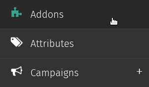
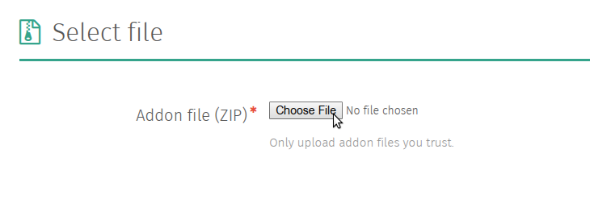
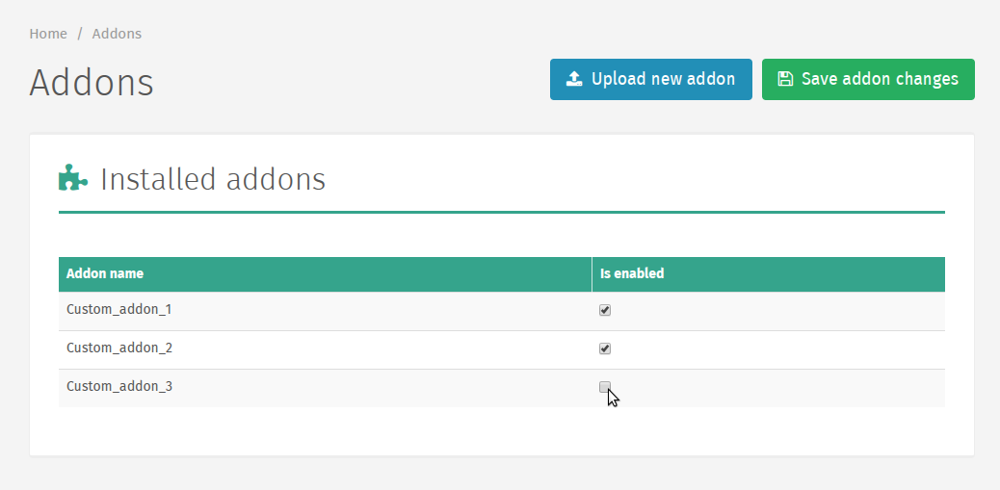

.. _Addons:

Addons
======

Installing Addons
~~~~~~~~~~~~~~~~~

.. note::
   Uploading addons is currently disabled in the Cloud version of
   Shoop.

Addons are installed through the Addons admin. To navigate to the
Addons admin, select `Addons` from the Shoop Admin menu.

Any installed addons will be listed on this page.

To upload an addon, click `Upload new addon` on the Addon toolbar.

.. note::
   Addons must be uploaded in .zip format

Next, upload the addon by selecting the .zip file with your file
selector and clicking the `Upload` button.

Once the file has been uploaded, you will be able to view any package
information as well as a list of the uploaded file contents.

Next, click `Install Addon` to install the addon. This will take you to
a page stating whether or not the installation was successful, and if
it was unsuccessful it will display more information about the error.

.. tip::
   When troubleshooting installation issues, it helps to copy and paste
   the error/traceback information.

You should be taken back to the Addon admin page, and unless there were
problems uploading your file it should be included in the list of
installed addons. However, it will not yet be enabled.

Enabling Addons
~~~~~~~~~~~~~~~

After an addon has been installed, it must be enabled. To enable an
installed addon, check the `Is enabled` column next to the addon name
and click `Save addon changes` on the Addons toolbar.

If changes were made to the list of enabled/disabled addons, the server
must be reloaded and a `Reload application` button will appear on the
Addons admin toolbar.

.. warning::
   When you reload the application server, it may take some time for
   the new instance of your application to properly initialize.

   In addition, there is always a chance for the server to not properly
   initialize at all, in which case you may need to troubleshoot the
   problem yourself (or have a system administrator handy).

Clicking this button will take you to the Reload Application Server
page, where the server can be reloaded by pressing the `Reload
Application Server` button.
