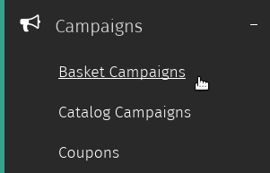
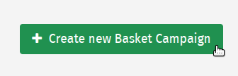
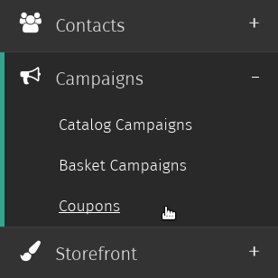
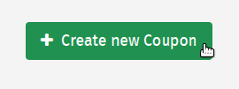
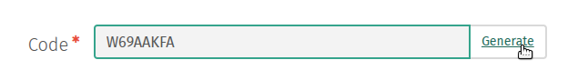
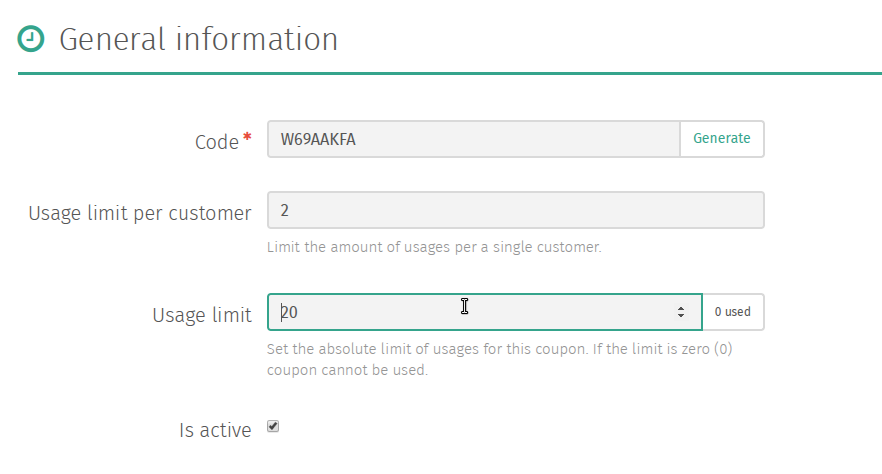

Campaigns
=========

Shuup e-commerce platform comes built in with customized and easily
extendable campaign management system. Shuup's modular campaign
management structure allows extending the feature to most innovative
campaign models and even integrations.

Creating a Campaign
-------------------

1. Navigate to the `Basket Campaigns` admin page by clicking 
   `Basket Campaigns` under the `Campaigns` category from the Shuup 
   Admin menu.

2. Click the `Create a new Basket Campaign` button in the 
   admin page toolbar.

3. Enter general information regarding the campaign, such as the name,
   public name, basket line text, start/end dates, and any coupons to
   be associated with the campaign.

   .. image:: campaigns/campaign-general-information.png

   +------------+--------------------------------------------+-----------+
   | Field      | Use                                        | Mandatory |
   +============+============================================+===========+
   | Name       | Name of the campaign (not visible on the   | Yes       |
   |            | shop front-end)                            |           |
   +------------+--------------------------------------------+-----------+
   | Public name| Public name of the campaign to be          | Yes       |
   |            | presented in the shop front-end, when the  |           |
   |            | campaign name is displayed                 |           |
   +------------+--------------------------------------------+-----------+
   | Shop       | Shop selector for multi-shop setup.  Shop  | Yes       |
   |            | where the campaign is active               |           |
   +------------+--------------------------------------------+-----------+
   | Start date | Setting start date for the campaign        | No        |
   | and time   | using date picker                          |           |
   +------------+--------------------------------------------+-----------+
   | End date   | Setting end date for the campaign using    | No        |
   | and time   | date picker                                |           |
   +------------+--------------------------------------------+-----------+

   .. note:: If no start date is provided, it will take effect
             immediately.

             If no campaign end date is provided, the campaign
             will stay in effect indefinitely.

4. Click `Save` to create the campaign. Once a campaign has been saved,
   rules and effects can be added to define its behavior.

.. tip::

   Try setting up a cross-selling basket campaign by offering a
   discount on one product when a customer purchases  a related product.

Rules and Effects
-----------------

Whether or not a campaign be applied to a particular order and how it
will be applied depends on its *Rules* and *Effects*.

Rules
    The conditions or criteria that an order must meet before a
    campaign will be applied. Different rules will be available depending on 
    whether they are being applied to a basket campaign or a catalog campaign.

Effects
    If a customer's order meets the requirements of all of the
    campaign's rules, any enabled effects will be applied to their
    order. These are usually discounts applied to the order, such as
    discounts on the total basket value, discounted or free quantities
    of a particular product, or other various types of discounts.

Coupons
    Used to limit usage of a basket campaign to only holders of a valid
    coupon code.

Adding Rules and Effects
~~~~~~~~~~~~~~~~~~~~~~~~

Once a campaign has been created, Rules and Effects can be added from
the campaign's admin page.

To add rules and effects:

1. Click the `Rules` or `Effects` tab on the left-hand side of
   the screen.

   .. image:: campaigns/rules-tab.png

2. Select the rule or effect type from the dropdown menu and click
   the `Add rule` or `Add effect` button below to add a new
   rule or effect form.

   .. image:: campaigns/add-rule-button.png

3. Enter any required values in the rule or effect form, and click
   `Save` to attach the rules or effects to the campaign.

   .. image:: campaigns/rule-form.png

Rules
~~~~~~

The following rules are available to campaigns:

Basket product count
    Limit to baskets containing at least the specific number of products
Basket maximum product count
    Limit to baskets containing at most the specific number of products
Basket total value
    Limit to baskets containing at least the specified total amount
Undiscounted basket total value
    Limit the campaign to match when it has at least the total value entered 
    here worth of products which doesn't already have discounts 
Basket maximum total value
    Limit to baskets containing at most the specified total amount
Products in basket
    Limit to baskets containing a certain quantity of the selected product(s)

    .. note::

       This rule applies if a basket contains *any* of the selected
       products (i.e., a certain amount of product A *or* a certain
       amount of product B).

       In order to require product A *and* product B, create a separate
       rule for product A and product B.

Contact Group
    Limit to customers belonging to a specific contact group
Contact
    Limit to selected customer contacts
Category products in basket
    Limit the campaign to match the products from selected categories
Day and hour
    Limit the campaign to selected days

Basket Effects
~~~~~~~~~~~~~~

Campaign Effects
~~~~~~~~~~~~~~~~

Creating a Coupon Code
----------------------

1. Navigate to the `Coupons` admin page by clicking `Coupons` under
   the `Campaigns` category from the Shuup Admin menu.

2. Click `Create new Coupon` button in the admin page toolbar.

3. Either type the desired coupon code you want your customers to enter
   or click the `Generate` button to randomly generate a coupon code.

4. Enter general information regarding the coupon, such as the usage
   limit per customer and the over usage limit (or total number of
   redeemable coupon codes).

.. tip::

   As coupon codes are redeemed through the store, the total number
   of used coupon codes will be visible through the coupon's admin
   page.
