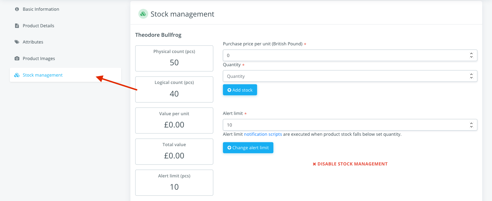
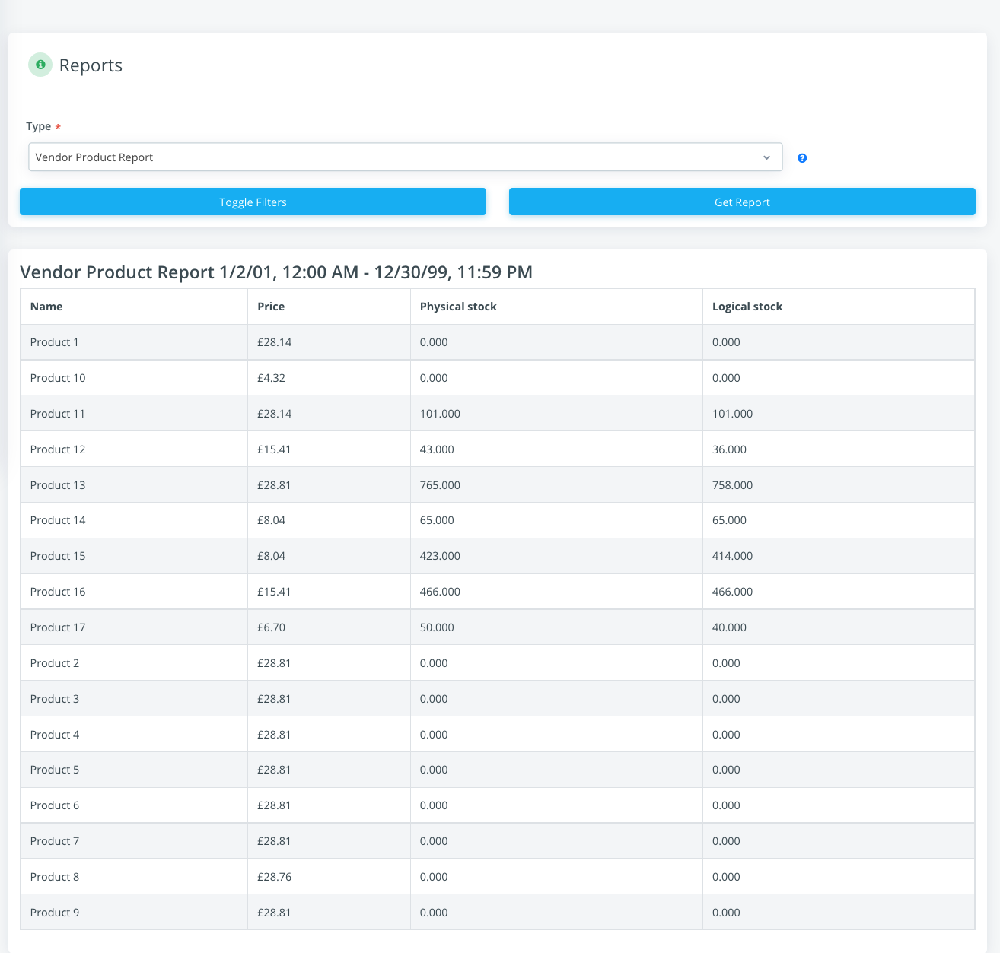
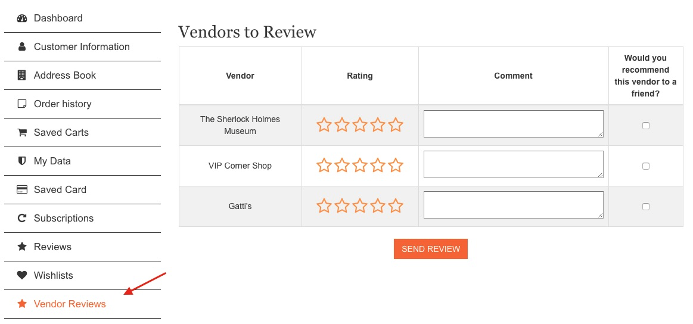
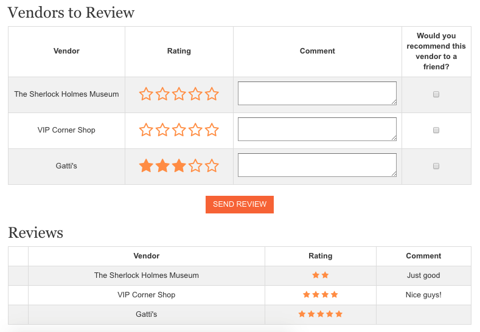
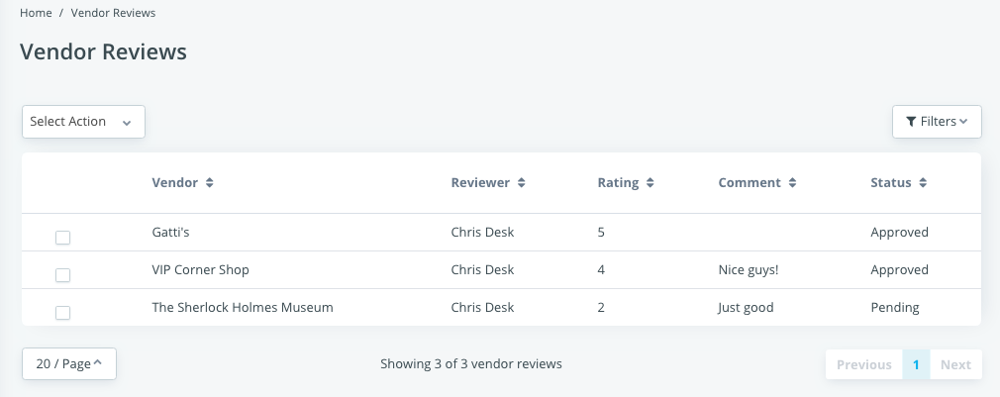
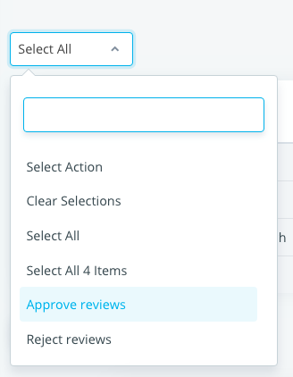
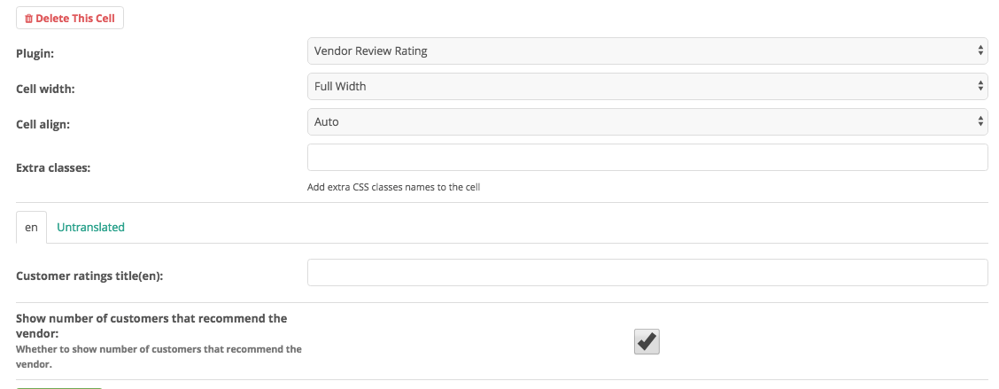
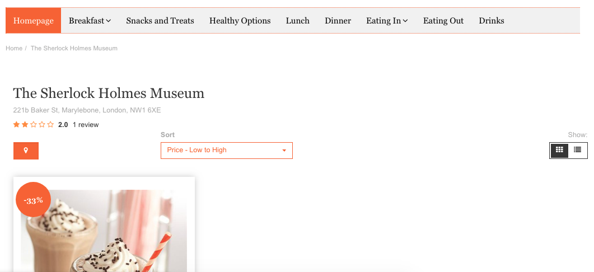

Multivendor
===========

.. note:: The Multivendor feature is currently only available through a license.
    For more information, contact support@shuup.com 

The Multivendor Addon enables multiple features that facilitate the management 
of a multivendor marketplace. The marketplace owner can manage several Vendors 
more easily while vendors can select the products they want to sell, their 
prices as well as manage their stocks.

User-roles and Permissions
~~~~~~~~~~~~~~~~~~~~~~~~~~

Permissions is the basic and Initial configuration all modern application 
should have. They are created to restrict features to a certain group of users. 
Shuup restrict the features using `Permission Groups`. A user can be linked to 
many permission groups. As the permissions must be explicitly granted (you must 
check what features are allowed to access), a user will accumulate all the 
permissions from all the linked permission groups. 

Common user roles for multivendor:

- Admin: (superuser). Superusers has all the permissions and can see all admin 
  modules available.
- Staff: Can see admin modules defined for the staff group. Main role is to 
  manage vendors, products and orders.
- Vendor: Can manage own products and manage vendor order lines, see vendor 
  reports.

These roles are already created in multivendor environment and can be tweaked 
to meet the project requirements.

See :ref:`Permission Groups` for more general informations on Permission Groups.

As a Vendor
~~~~~~~~~~~

Vendor Registration
^^^^^^^^^^^^^^^^^^^

1. From the marketplace home page, navigate to `/v/register` to access the 
   registration form. 

2. Fill out the Vendor information part with the name and address of your 
   store, the Owner part is about you and the Login Information will allow you 
   to access the admin Panel of the your store in the marketplace. If need be, 
   you can update those informations later in the Vendor `Settings`_

3. Click Register. 

Notifications 
*************

After the registration, you will receive an email notification confirming that 
your registration is complete.

.. note:: You will not be able to log into your account on the marketplace 
    until a marketplace staff member approves your registration.

You will get another email notification when your registration is approved.

Admin Panel
^^^^^^^^^^^

From the marketplace home page, navigate to `/admin`, type in your username 
and password and click the Login button to access the admin panel. You will 
be shown your dashboard with a summary of your sales.

Settings
^^^^^^^^

Navigate to the `Vendor Settings` page by clicking `Vendor Settings` 
under the `Settings` category from the Shuup Admin menu.

You can update the name, description and logo of the Vendor and use the tabs 
on the left-hand side to update the contact address and the opening periods.

Click on the `Go to vendor page` button to be taken to your vendor page on the 
store front.

Product Management
^^^^^^^^^^^^^^^^^^

Navigate to the `Vendor Products` page by clicking `Products` under the 
`Products` category from the Shuup Admin menu.

On this page, you will find all the products available to the marketplace. To 
find a product more easily, you can filter them by name. You can manage your 
stocks, start and stop selling products and set the price. If no price is set, 
the default price will be used.

Stock Management
^^^^^^^^^^^^^^^^

Stock management is a crucial feature that all e-commerce platforms must have. 
Shuup is designed to be the more extendable as possible.

To a product be able to be purchased, it `must` have at least a `Supplier` set. 
Suppliers are responsible to return whether a product can be purchased for a 
given quantity (and other context values such as the current customer).

In multivendor environment, each Vendor is a Supplier behind the scenes, and 
the vendor can manage only the products it supplies.

Managing Stocks
^^^^^^^^^^^^^^^

To manage stocks, go to `Product > Products`. Pick a product and click on the 
`Stock Management` section. 

On this management panel it is possible to update stocks, alert limit and 
disable the stock management for this specific product.

The initial management status is configured per-project. If the stock management 
is disabled, the product can be purchased unlimitedly – no stocks are checked.

To update stocks, fill the `Quantity` field and press the `Add stock`. The 
purchase price can be optionally filled for future reports. Stock will be 
incremented if the quantity is a positive number and decremented if the quantity 
is a negative number.

The alert limit can also be set and when Notifications addon is enabled, it will 
trigger an event that can be configured send email to users or any other logic.

Stock reports
^^^^^^^^^^^^^

Stocks can be listed in a simple way using a stock report. Go to `Reports` and 
select the `Vendor Product Report`, fill the filters if needed and press the 
`Get Report button`.

The report shows the product name, price and the current stock status. Logical 
stock is the number of products available for sale and Physical stock is the 
number of products that are physically in stock and they are waiting to be 
shipped. Both numbers will be equal when all products from their orders are 
fully shipped.

See :ref:`Stock Management` for more general information about Stock 
Management.

Orders
^^^^^^^

Navigate to the `Vendor Orders` page by clicking `Vendor Orders` under the 
`Orders` category from the Shuup Admin menu.

On this page, you will find all the orders that have been made for the vendor. 
There are multiple filters available to single orders out. 

Click on an order to see the order information like the order number and 
reference, the customer name, email, billing and shipping address as well as 
the product name, quantity and price.

Depending on your marketplace configuration, it might also be possible to 
create a shipment, set the tracking code or the order status.

As a Marketplace Staff Member
~~~~~~~~~~~~~~~~~~~~~~~~~~~~~

Create a new Vendor
^^^^^^^^^^^^^^^^^^^

1. Navigate to the Vendors Management page by clicking `Vendor Management` 
   under the `Settings` category from the Shuup Admin menu.

2. Click on the `+ Create new` button.

3. Fill out the Vendor's name. You can also add a description, a logo and 
   management users. Make sure the `Enabled` and `Approved` checkboxes are 
   selected.

4. Click on the  `Contact Address` tab on the left-hand side to fill out the 
   contact name and address.

5. You can set up opening periods in the `Opening periods` tab on the left-hand 
   side.

6. Click on the `Save` button.

The Vendor will receive an email notification for the registration and another 
one for the approval if the `Approved` checkbox was selected during the 
creation process. Vendors can log in their admin panel as soon as they are 
approved.

See :ref:`Notifications` to set up customized Notifications

Approving a Vendor
^^^^^^^^^^^^^^^^^^

1. Navigate to the Vendors Management page by clicking `Vendor Management` 
   under the `Settings` category from the Shuup Admin menu.

2. Select the Vendor you want to approve.

3. You can edit the Vendor's informations such as their name, description 
   logo, contact address and opening periods.

4. Select the `Approved` checkbox.

5. Click `Save`.

The Vendor will receive an email notification once their registration is 
approved. Vendors can log in their admin panel as soon as they are 
approved.

See :ref:`Notifications` to set up customized Notifications

Orders from all Vendors
^^^^^^^^^^^^^^^^^^^^^^^

Navigate to the `Vendor Orders` page by clicking `Vendor Orders` under the 
`Orders` category from the Shuup Admin menu.

On this page, you will find all the orders that have been made for  all the 
vendors in the marketplace. There are multiple filters available to single 
orders out. 

Click on an order to see the order information like the order details, the 
customer name, email, billing and shipping address as well as the product name, 
quantity and price.

Depending on your marketplace configuration, it might also be possible to 
create a shipment, set the tracking code or the order status.

See :ref:`Orders` for more information.

Vendor Reviews
~~~~~~~~~~~~~~

Vendor reviews module stores users’ ratings for vendors.
 
Requirements to a review be visible in the storefront:
- Users can only create reviews for vendors of completed orders
- The review should be approved by staff users
- Xtheme plugin must be placed in placeholder inside the vendor detail view

Creating a vendor review
^^^^^^^^^^^^^^^^^^^^^^^^

After the user has placed his order and the order is in a completed status, 
the user can create the review in the `Customer Dashboard`:

The user must select the star rating also add some comment and check whether 
he would recommend that vendor to a friend. After that the review will be 
available for visualization. The user can change the vendor review at any 
time by submitting the reviews again.

Once the review is sent, it should be approved by a staff user in 
`Admin > Settings > Vendor Reviews`:

The staff must select all the reviews he wants to approve/disapprove and 
select the respective action in `Mass Action dropdown`:

Done. After the review is approved, it will be visible at the storefront.

Configuring the plugins
^^^^^^^^^^^^^^^^^^^^^^^

The module provides a plugin to render the customer ratings in places where a 
vendor is available in context, like the Vendor Detail page. You must add the 
`Vendor Review Rating` plugin and configure it as needed:

After all these configurations, the vendor review module will be working as it 
should.

