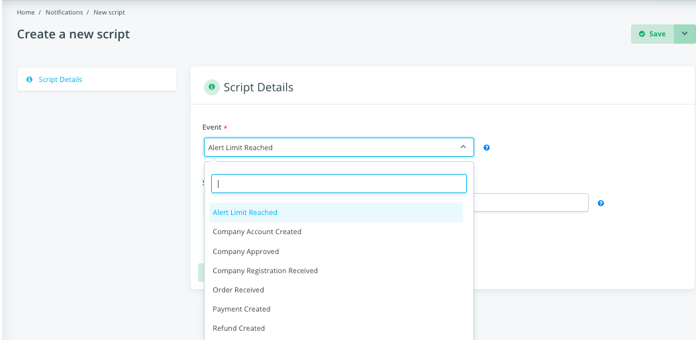
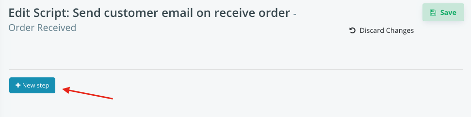
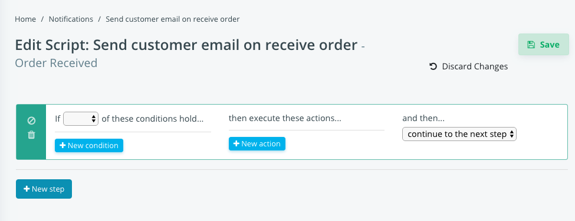
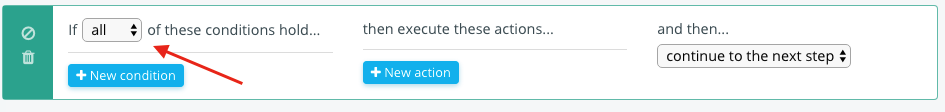
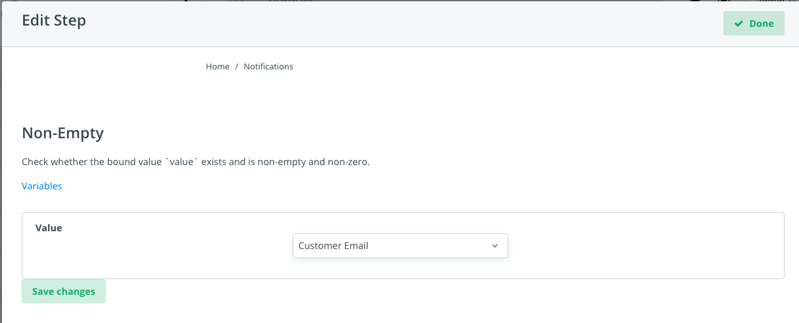
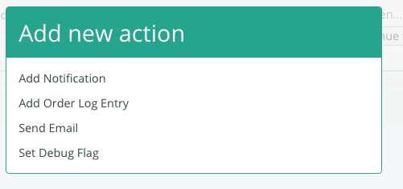
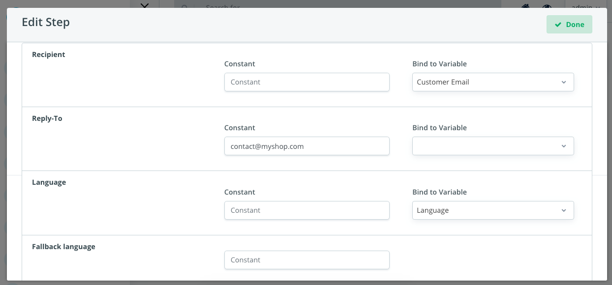
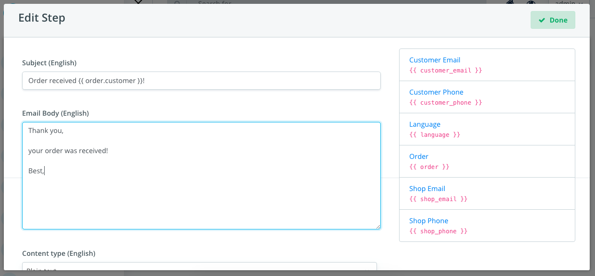

Notifications
=============

Concept
~~~~~~~

Shuup has a notification system that allow users to handle `events` triggered 
by the platform and execute ``actions`` for that when a set of configured 
conditions are met. It can be translated into this phrase:
Do X when Y if W => Send email to customer when received a new order if the 
user has a valid email

`Events` could include: 

- orders being created
- shipments being dispatched
- vendors requesting registration
- many others

Notifications may be delivered over different channels, such as email, as 
delivery channels are also pluggable (requires developed addons that handles 
the channel). Notifications are basically the ``Actions`` that will be executed 
by the platform.

Configuring Notifications
~~~~~~~~~~~~~~~~~~~~~~~~~

To handle a notification, go to `Settings` > `Notifications`. Click on 
`New Script`.

Select the event you want to handle and give it a name to describe what it is 
doing, like `Send customer email on receive order` and make sure `Enabled` 
checkbox is checked. Click `OK`.

After that you should see a blank page with a `New Step` button. Click on 
`New Step` button, a new row will be visible.

The script can have as many steps as you want, you can remove steps and also 
disable them. You can add conditions to each step to be executed, like checking 
whether the customer has a valid phone or email before actually sending the 
email/SMS.

Select the `all` operation next to the `New condition` button if you don't want 
to add any condition (this will make sure the script will run every time).

To add a new condition, click on `New condition` button and select the desired 
one. A form will appear to be configured with all the parameters of the 
selected condition. Here is an example of `Non-Empty` condition:

After you configured the condition, click on `New action` to select how to 
handle the event. 

Select the action type (like Send email). A new form will be rendered to fill 
all the parameters of the selected action.

In Send Email action, you need to fill the Recipient and the Language of the 
email to be sent (and other optional fields). As you may ask yourself, how can 
I know the email of the customer in cases you want to send an email when 
customer places an order. In these cases, the event will provide "variables" 
that can be bound to the action parameters. In the `Order Received` event, for 
example, it provides a `Customer Email` variable you can use in the 
`Recipient`, so it will use the email that customer entered when placing the 
order. Each event can provide a different set of variables that can be used in 
the script.

Some actions may request text contents as parameters. This is the case of Send 
Email event which requires the merchant to fill the email subject and email 
body to send to the configured recipient. To configure the email template, 
click on the language tab and fill the subject and body fields of the email. 
You may notice a list of variables on the right side. Those strings are special 
words (variables) that can be used in the email subject or body and they will 
be replaced by the value it describes when generating the email to be sent.

Make sure to save the email parameters by clicking on `Save Changes` button and 
then click on `Done` button. Save the entire script by clicking `Save` and the 
notification is completely configured.