.. _Orders:

.. raw:: html
   

######
Orders
######

******************
Summary of Content
******************
   * :ref:`order explain` 
   * :ref:`order admin and staff`
   * :ref:`order vendor`

.. _order explain:

*****************
Order explanation
*****************

.. _order explain what:

What is a order
===============

A order is the complet summery of what a cusomer is/has purchsed.

.. _order explain create:

How are orders created
======================

Orders can be made in one of two ways:
   * By a customer through the shop front
   * By a merchant through the Shuup Admin.

.. _order admin and staff:
.. rst-class:: admin

***************
Admin and staff
***************

When logged in with a staff account navigation to the `Orders` tab.
You will be shown a page like this.

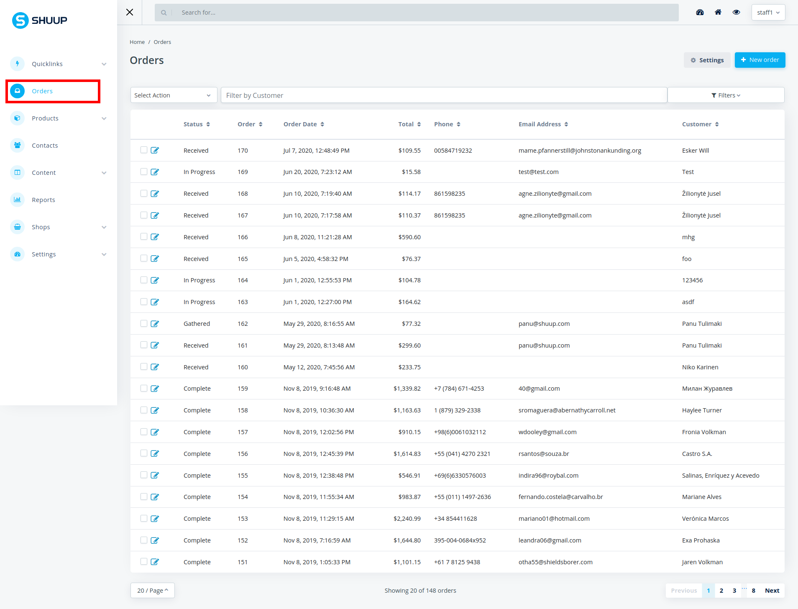

There are a few different kinds of actions you will be able to make on this page.
The the number to corresponds to the closes field.

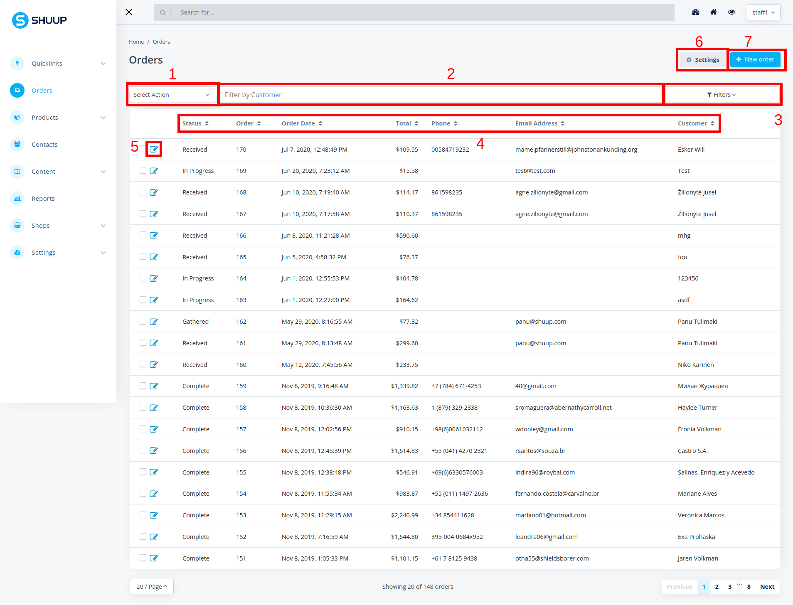

      The red number corresponds to the closest red box,
      and also to the number in list below.

1. **Select action**
   
   Here you can select different kinds of actions to do on multiple orders.
   If you are trying to do a action that requires selected order and you have not selected any,
   it will tell you that through a warning message.
   To select orders to use the actions on you can click on the orders you want to use.

2. **Filter by customer**

   Filters the orders so it's only showing orders made by a certain customer.
   Type in the customers name and it will filter the orders.

3. **Filters**

   Here you can do some more advanced filtering.
   Just fill in the information you want to filter by and the table will update it self,
   to only show orders with that specific information.

4. **The columns in the tabel**

   Here you can order all the lines in the table.
   This is done by clicking the pyramid next the the column name.
   This will toggle the ordering of the tabel to be in alphabetical order or numerical order,
   depending on which column you sort by.
   If you click the pyramid again it will do the same sort only in revers.

5. **Edit order**

   If you want to edit a order click here and it will bring up the edit order page,
   explained in more detail at :ref:`order details`.

6. **Settings**

   By clicking on settings you will be able to add and remove which columns are shown on this page.

7. **New order**

   Create a new order, explained in :ref:`order new`.

.. _order new:

New orders
==========

1. Navigate to the Orders admin page by clicking `Orders` under the
   `Orders` category from the Shuup Admin menu.

   .. figure:: orders/admin-staff/orders-location-in-menu.png
      :width: 80%
      :align: center
      :alt: orders-location-in-menu
      :figclass: align-center

2. Click the `New order` button on the Order admin toolbar.

   .. figure:: orders/admin-staff/new-order-button-location.png
      :width: 80%
      :align: center
      :alt: orders-location-in-menu
      :figclass: align-center

3. Under the **Customer details** section, search the customer by name 
   or email, to select the customer click on the name.

   If you click the search icon, it launch the customer selection popup
   where you also can search for the customer.

   By leaving the field blank it will create a new customer along with the order.

   If you select the wrong customer you can either 
   search for the correct one and select that customer again or
   by clicking the bin icon that will remove the customer.

   .. figure:: orders/admin-staff/customer-selection.png
      :width: 80%
      :align: center
      :alt: orders-location-in-menu
      :figclass: align-center

   When the customer is select correctly you will be able to view the customers details.

   .. figure:: orders/admin-staff/customer-selection-complete.png
      :width: 80%
      :align: center
      :alt: orders-location-in-menu
      :figclass: align-center

4. Fill in the rest of the customer details,
   
   this includes the billing and shipping address.

5. Under the **Order contents** section, you will select all 
   order lines witch the order will contain.

   If you want to add an existing product to the order,
   search for with the text input filed.
   This will search through all products that are visible.
   If you want to add products that are not visible, click on the search icon to bring up
   the product popup window.

   .. figure:: orders/admin-staff/order-product-selection.png
      :width: 80%
      :align: center
      :alt: orders-location-in-menu
      :figclass: align-center

   Either way you search for the product you will need to click it so it gets added to the order

   If you want to add a blank order line to the order click `Add new line`.
   These can either be of type `product`, `other`, or `text/comment`.

   .. figure:: orders/admin-staff/blank-order-line.png
      :width: 80%
      :align: center
      :alt: orders-location-in-menu
      :figclass: align-center

   Here are the types of lines you can create in an order:

   Product line
      A product, quantity, and any pricing or discount information
   Other line
      A miscellaneous priced line
   Text/Comment line
      A non-priced text line

6. Select a shipping and payment method for the order from the
   `Shipping Methods` dropdown and the `Payment Method` dropdown.

   .. figure:: orders/admin-staff/new-order-select-ship-and-payment.png
      :width: 80%
      :align: center
      :alt: orders-location-in-menu
      :figclass: align-center

7. When you have filled in all the fields the pages should look something like this

   .. figure:: orders/admin-staff/order-proceed.png
      :width: 80%
      :align: center
      :alt: orders-location-in-menu
      :figclass: align-center

   
   Now you can to press the `Proceed` button.

   .. note::
      Method rules, taxes and possible extra discounts are calculated after clicking `Proceed`.

8. You will now be able to se all the order details before confirming the order.

   When clicking `Confirm` the order will get placed.

   .. figure:: orders/admin-staff/order-conformation.png
      :width: 80%
      :align: center
      :alt: orders-location-in-menu
      :figclass: align-center

.. _order details:

Order details
=============

Basic details
-------------

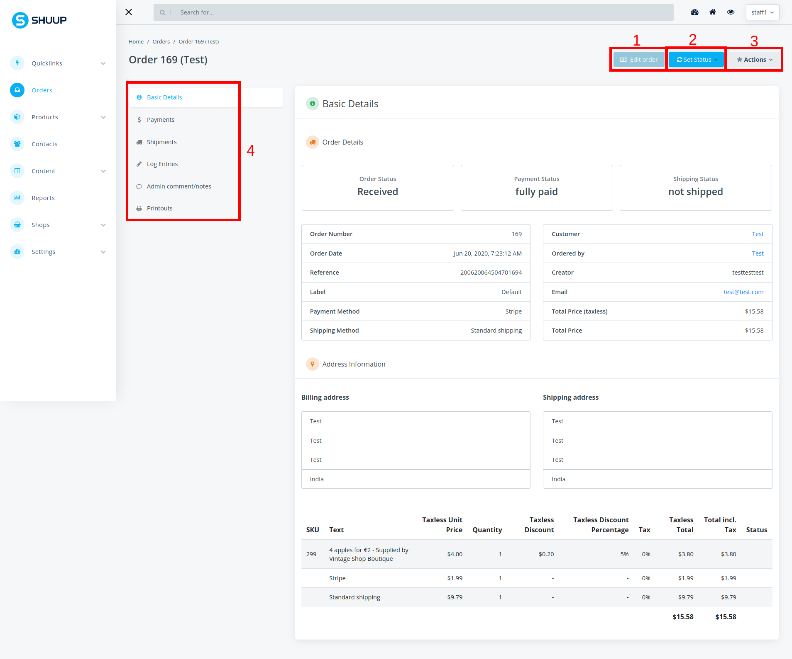
      
      The red number corresponds to the closest red box,
      and also to the number in list below.

1. **Edit Order**

   To be able to use this action the order can not have been payed and can not have been shipped.
   If the action is available you can click on `Edit order` and edit it,
   please read the :ref:`order new` documentation for more information on what to do on the page.

2. **Set Status**

   Here you can edit the status of the order.
   Remember that even tho all the statuses are shown you can't always change the status to what you want there.
   Example if a order is payed for by a customer you can select the `Canceled` status to do that you will have to create a refund first.
   Same goes for setting a `Completed` states, the order will have to be payed for and shipped for you to be able to select this status.
.. raw:: html
   <---- #TODO: Link to order status part ----->

3. **Actions**

   Actions are only available on orders that aren't completed.
   This is where you can change the address of the order. :ref:`order address change`.
   Depending on if the order is payed for or not you will be able to create a refund or create a payment.
   Click on either the `Create payment` or `Create refund` and then follow the documentation from :ref:`order payment`.

4. **Other details/sections of the order**

   Here you can navigate to other sections/details/actions for the specific order you are on.
   Please continue reading this documentation for more information.

Payments
--------

Here you can view all of the payments that have been made to this order.
If there has been many small payments they will all show up separately.

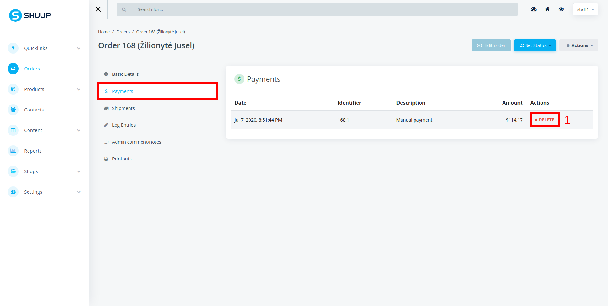
      
      The red number corresponds to the closest red box,
      and also to the number in list below.

1. **Delete**

   This just delete the payment.

   .. note::
      * This will not refund the customer.
      * This will remove the payed sum for the total payed sum for the order

.. _order detail shipment:

Shipments
---------

Here you can view all things related to shipping. Which products have been shipped, refunded and still needs shipping. 

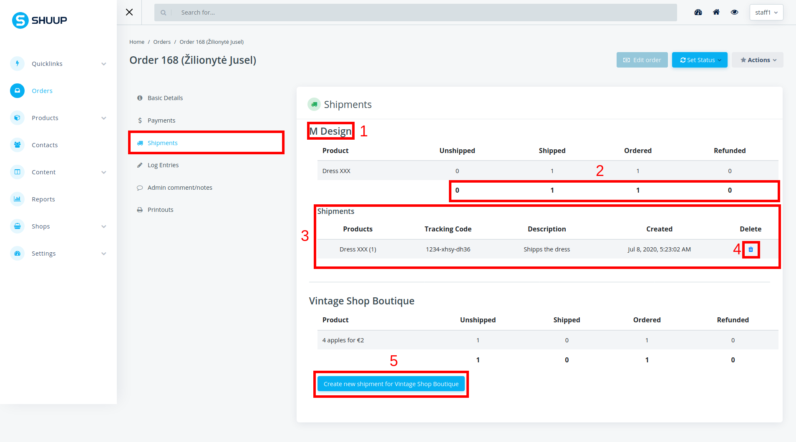
      
      The red number corresponds to the closest red box,
      and also to the number in list below.

1. **Vendor name**

   Displays the name of the vendor from where the product/products were bought.

2. **Totals**

   Displays the total number of items that are unshipped, shipped, ordered and refunded.

3. **Shipments**

   Displays every item that has been shipped by the vendor.

4. **Delete**

   Deletes the shipment line.

   .. note::
      * This will not affect products physical stock count.

5. **Create shipments**

   Creates a shipment for the vendor.
   Click on the `Create new shipment for` button and continue reading the documentation under :ref:`order shipment create`.

Log entires
-----------

Shows logs on the order.

.. note::
   This will only show the latest 12 logs the rest are unaccessible as of shuup version 1.11.0

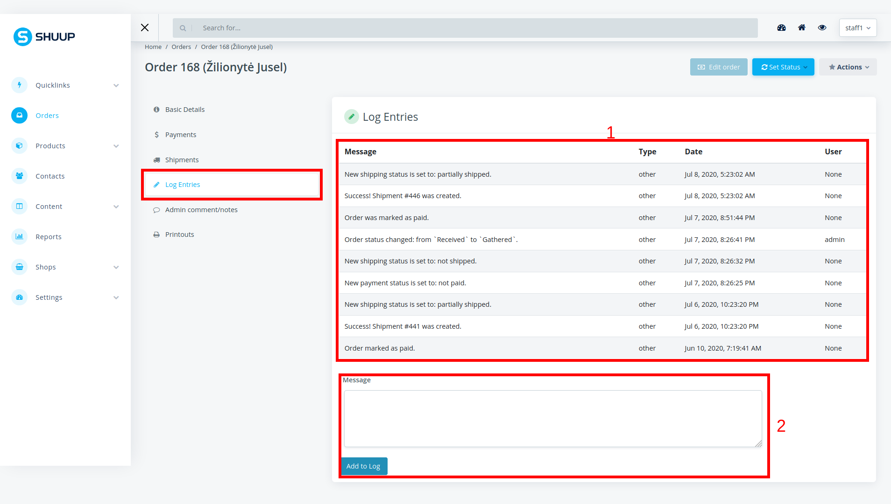
      
      The red number corresponds to the closest red box,
      and also to the number in list below.

1. **Logs**

   Table of the logs. 
   When the users is `None` the log entry was made by the system,
   even tho the action leading to the log entry was made by a user.

2. **New log**

   If you want to create a log entry type in the message text in the text filed and then click on `Add to log`.
   This will add the log message to the logs. And remember when typing the message even tho the message box is big you can only enter 256 characters.

Comments
--------

Save a comment to the order. This comment will only be available for the staff and admin

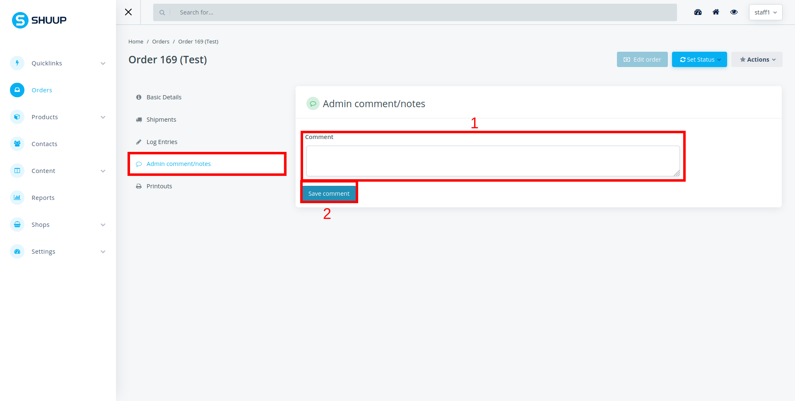
      
      The red number corresponds to the closest red box,
      and also to the number in list below.

1. **Comment**

   Here the comments will be enter and shown.

   .. note::
      You can only have one comment so what ever is saved in the text filed is the comment.

2. **Save comment**

   Press this button to save what ever is in the comment field

.. _order detail printout:

Printouts
---------

Here you can send mails to the customer. Also be able to download PDF files of the order, or view it in html.

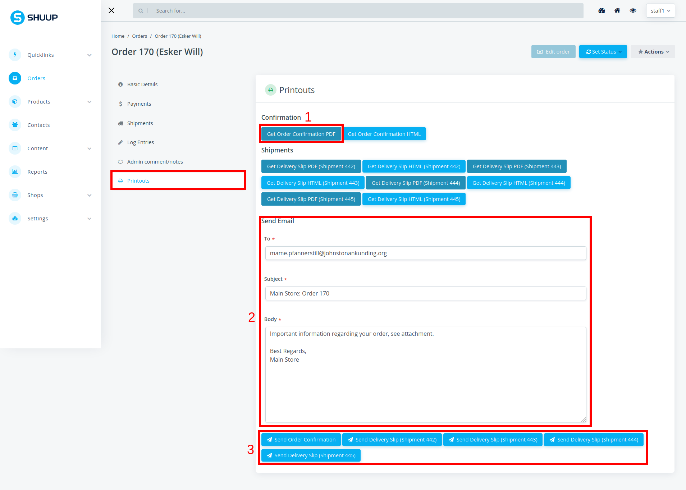
      
      The red number corresponds to the closest red box,
      and also to the number in list below.

1. **View printouts**

   Clicking on the button will open up a new tab in your browser where you can view the file or the html.
   The PDF file and the html print out might vaire a bit.

   The same applies for all the printouts even the shipments.

2. **Mailing customer**

   There will always be some text generated in the mail inputs,
   but if you want to change the mail address that it's sent to,
   the subject or the body you can edit the text.

3. **Sending the mail**

   Depending on the number of shipments the order has there will be different amount of send buttons.
   When clicking on one of the `Send` buttons it will send the mail to the mail address specified in the `To` field.
   The subject and body of the mail will consist of there respective fields.
   But it will also include the PDF file as a attachment in the mail.
   The PDF file which is included in the mail will be decided by which `Send` button you click on.
   So if you click on the `Send Order Confirmation` button it will attach the `Order Confirmation PDF`.

Order Shipments
===============

To get to the shipment page for a order please read the :ref:`order detail shipment`. 

.. _order shipment create:

Creating a order shipment
--------------------------

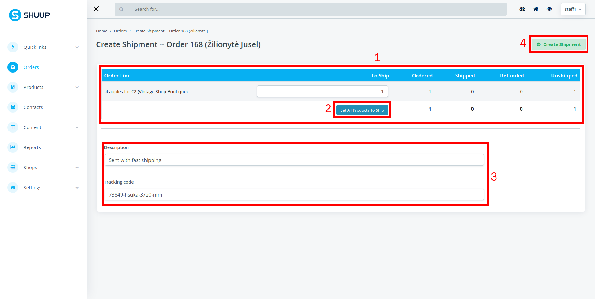
      
      The red number corresponds to the closest red box,
      and also to the number in list below.

1. **Shipment table**

   Displays all the products that have been ordered from this vendor.

   To Ship
      This is the column were you need to enter the number of products for the order line that will get shipped.

2. **Set all products to ship**

   This button will fill in all the `to ship` fields,
   to the number of products that still needs to be shipped to satisfy the order for the vendor.

3. **Extra data**

   Description
      Here you can enter whatever you want, this will only get displayed on the :ref:`order detail shipment` page.
   Tracking code
      If there is a tracking code for the shipment enter it here.
      The tracking code will be included in the printout files on :ref:`order detail printout` page.

4. **Create shipment**

   When the desired information is filled in you can click the `Create shipment` button. Then the shipment will get created and you can go you it on :ref:`order detail shipment`

.. _order payment:

Order Payments
==============

All payments can be viewed on :ref:`order detail payment`

Create Order Payment
--------------------

You can create payments for whatever sum you want, so if you just got a partial payment you can enter it.

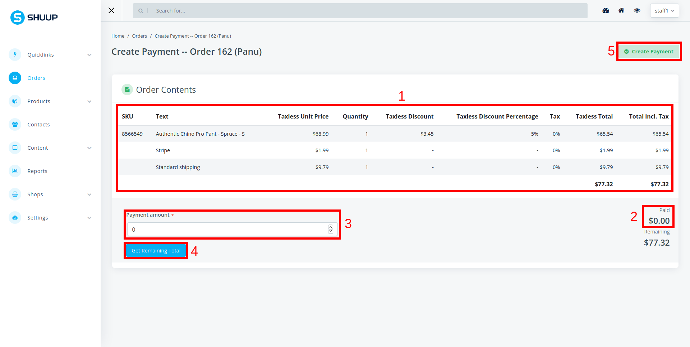
      
      The red number corresponds to the closest red box,
      and also to the number in list below.

1. **Payment table**

   Here you can view all of the costs that are associated with the order.
   All of the lines that are not products are related costs like shipping and the payment method.

2. **Already paid**

   The `Paid` number is the sum the customer already has payed. If there are many small payments the total of them will be shown.

3. **Payment Amount**

   The amount that the customer is paying. This can not be more then the remaining cost.

4. **Get remaining total**

   Fills the `payment amount` to what the remaining sum is.

5. **Create payment**

   After the `payment amount` is entered you can click on `Create Payment` and the payment will be created.

Create Order Refunds
--------------------

Orders can only be refunded once at least one payment has been created for the order.

.. warning::
   The refund amount dose not have a minimum requirement on the sum so
   you can create refunds that are completely under value.

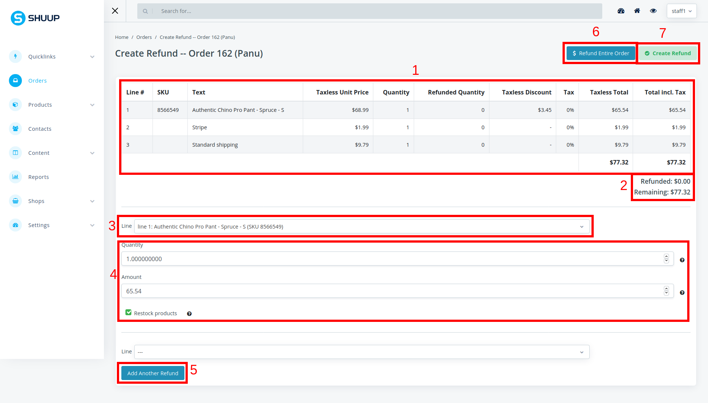
      
      The red number corresponds to the closest red box,
      and also to the number in list below.

1. **Order payment lines**

   Displays all of the lines that are refundable

2. **Totals**

   Due to that you can create multiple refunds here you can see the the total amount that has already been refunded.

   .. note::
      The remaining amount is calculated from the "total order pice - refunded amount = remaining amount".
      This means that remaining amount dose not take in to if the order is fully payed or not.

3. **Line select**

   Select the line that you want to make the refund on.

4. **Line refund details**

   When you have select a line these fields will automatically get filled in.
   If there is something you want to change you can do it here.

5. **Add refund line**

   If you want to create multiple refunds you can add one more refund line by click the `Add Another Refund` button.

6. **Refund entire order**

   Refunds the hole order. Remember that this will refund everything on matter if the order is fully paid or not.

7. **Create Refund**

   Creates the refund based on the data that is in the refund details.

.. _order vendor:

******
Vendor
******