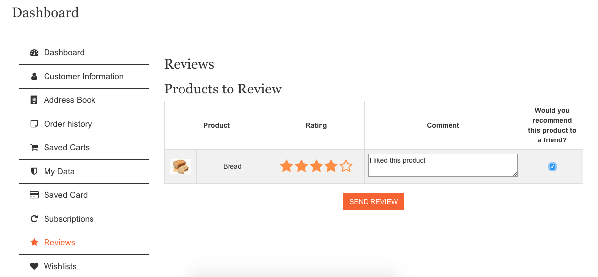
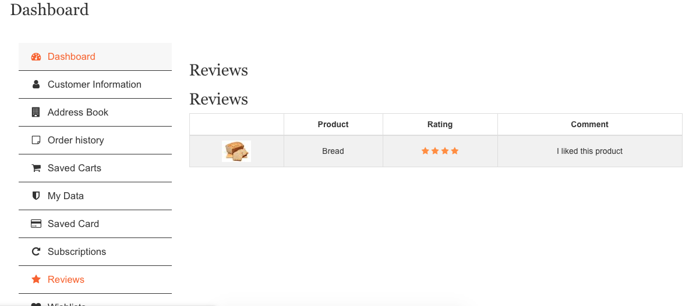
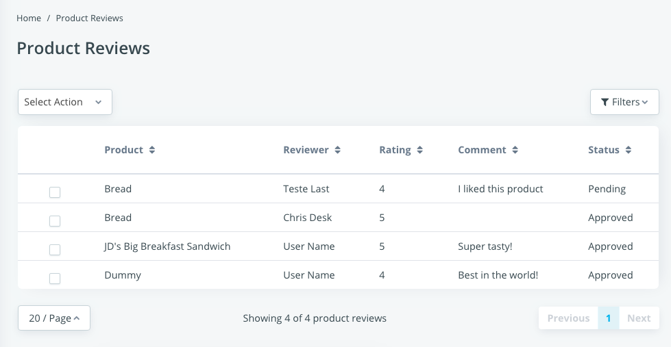
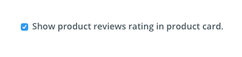
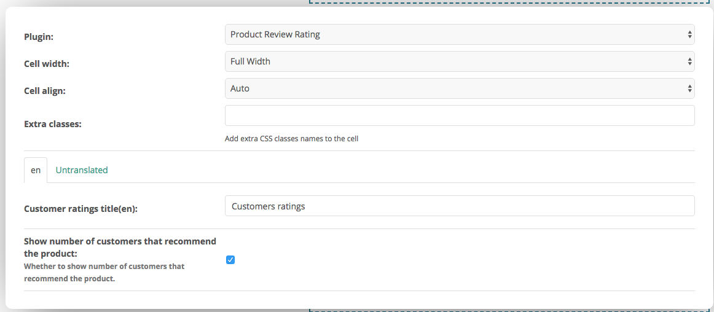

Product Reviews
===============

Product reviews module stores users’ ratings for products that were ordered by 
them.

Requirements to a review be visible in the storefront:

- Users can only create reviews for completed orders
- The review should be approved by staff users
- Theme should be configured to show product rating on product card
- Xtheme plugin must be placed in placeholder inside the product detail view

Creating a Review
^^^^^^^^^^^^^^^^^

After the user has placed his order and the order is in a completed status, the 
user can create the reviews in customer dashboard:

The user must select the star rating also add some comment and check whether he 
would recommend that product. After that the review will be available for 
visualization:

Once the review is sent, it should be approved by a staff user in 
`Admin > Products > Product Reviews`:

The staff must select all the reviews he wants to approve/disapprove and select 
the respective action in Mass Action dropdown:

.. image:: product-reviews/mass-action-dropdown.png

Done. After the review is approved, it will be visible at the storefront.

Configuring the theme
^^^^^^^^^^^^^^^^^^^^^

The selected theme should allow showing the product review rating in product 
card. Go to your theme configuration and check the options. It should provide 
something like this:

Check that and save.

Configuring the plugins
^^^^^^^^^^^^^^^^^^^^^^^

The module provides a plugin to render the customer ratings in places where a 
product is available in context, like the Product Detail page. You must add the 
Product Review Rating plugin and configure it as needed:

After all these configurations, the product review module will be working as it 
should.
