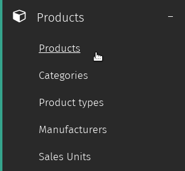
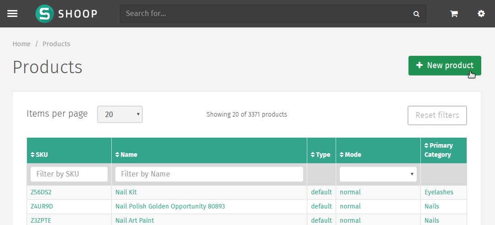
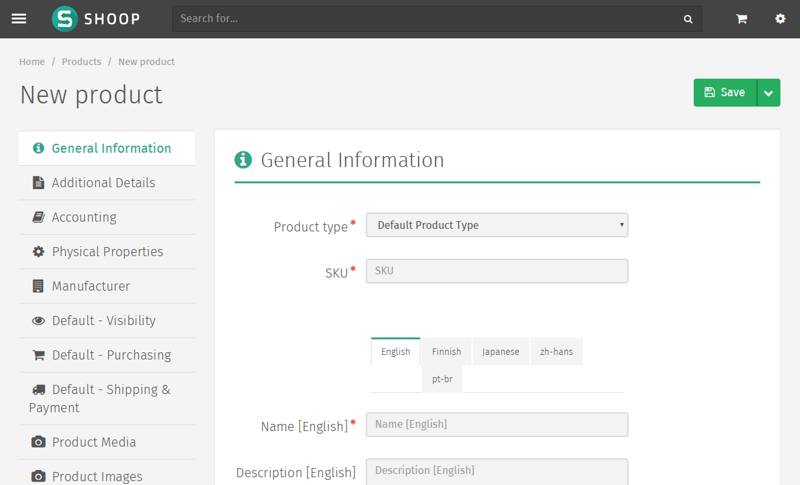
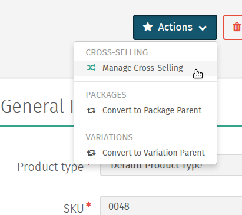
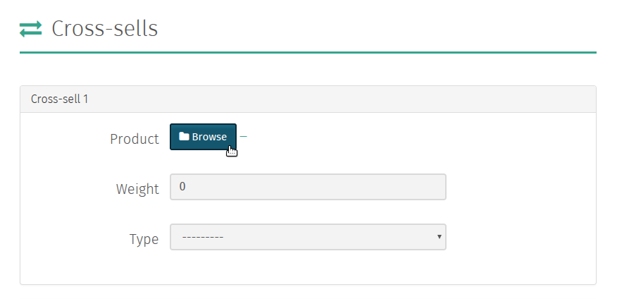
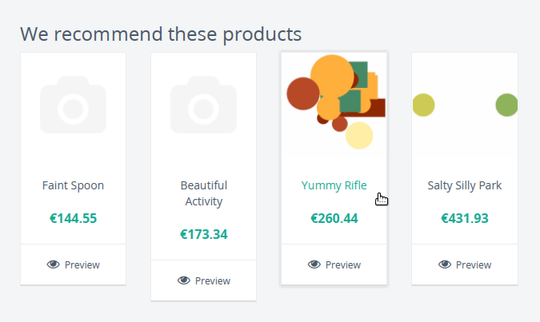
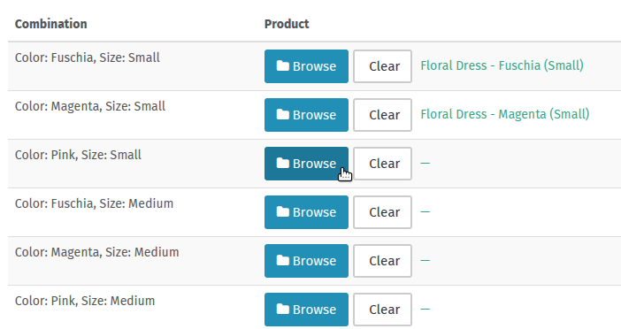

Products
========

Adding Products
---------------

The Shuup Admin provides a simple interface for adding products to your
shop.

To navigate to the Products section of the Shuup Admin, open the Admin
menu and select the `Products` section under the `Products` category.

On the `Products` page, you will a list of all of the products currently
in your shop. In the upper right-hand corner, there is a button labelled
`New product`.

New Product Form
~~~~~~~~~~~~~~~~

Clicking this will take you to the `new product form`, where you can enter
information about your new product.

Like other Shuup Admin forms, required fields are marked with a red
asterisk and missing or invalid fields will be highlighted red on form
submission.

The left side of the form contains a number of sections of the form
(shown as tabs), and selecting a tab will present the different fields
and options for that section.

Base Product Tabs
^^^^^^^^^^^^^^^^^^

The top section of the form contains most of the basic product information
and settings.

General Information
    General information about the product, including product type, name,
    and product description.
Additional Details
    Miscellaneous information regarding the product, such as the product's
    stock and shipping mode, barcode information, and relevant keywords.
Accounting
    Bookkeeping-related information.
Physical Properties
    Physical dimensions and unit information for the product.
Manufacturer
    Selection choice for the product's manufacturer.

Shop-Specific Tabs
^^^^^^^^^^^^^^^^^^

Following the base product section are the following shop-specific tabs.
The names of these are preceeded by the relevant shop's name (initially
*Default*):

Visibility
    Front-end visibility settings for a specific shop.
Purchasing
    Pricing, supplier, and multiple-purchase settings.
Shipping & Payment
    Shipping and payment service-related settings (used to limit customer
    shipping and payment choices on checkout).

Media Tabs
^^^^^^^^^^^^^^^^^^

These sections are for managing the image and digital media content related
to the product.

Product Media
    Product-related file uploader and selector.
Product Images
    Product image uploader and selector.

.. tip::
   Advanced Product Media settings can be configured to deliver digital
   and downloadable content.

Customer Group Pricing Tab
^^^^^^^^^^^^^^^^^^^^^^^^^^

Pricing settings based on customer groups. If a customer belongs to
multiple groups, they will be presented the lowest price of the groups
to which they belong.

.. note::
   Customer Group pricing is currently not configurable for specific shops.

Saved Product Form
~~~~~~~~~~~~~~~~~~

Once the product has been successfully saved, additional options will be
available from the product edit form.

Attributes Tab
^^^^^^^^^^^^^^

See Attributes_.

Stock Management Tab
^^^^^^^^^^^^^^^^^^^^

For stocked product, this should display any stock-related management tasks
depending on the product's supplier settings.

.. todo:: Add complete reference for product fields

Orders Management Tab
^^^^^^^^^^^^^^^^^^^^^

Show recent orders containing the product.

Product Types
-------------

Product Types define classes products and are used to associate different
sets of attributes_ to a particular product, depending on its product type.

For example, a product of type *Book* might require specific information
such as author, ISBN, publisher, etc, while a product of type *Clothing*
might require size, color, or other custom attributes.

Attributes
----------

Shop owners can define their own attributes for `Product Types`_ from the
Attributes Admin.

1. Select the `Attributes` category from the Shuup Admin menu
2. Click the `New attribute` button in the upper right-hand corner
3. Enter a name and **unique** identifer for the attribute, and select
   the type, visibility mode, and searchability for the attribute
4. Select the `Product Type` page (under the `Products` category) from
   the Shuup Admin menu
5. Select the Product Type from the menu
6. Under the `Attributes` tab, check the box next to the attribute
   name for your new attribute.

.. tip::
   By default, new attributes are displayed on the product page, but there
   are multiple visibility options that can be selected form the Attributes
   edit page.

Cross-Selling
-------------

Adding Cross-Sells
~~~~~~~~~~~~~~~~~~~~~~~~~~~~~~~

Related products can be sold together on Shuup's storefront by
using Shuup's cross-selling feature. These relationships can be
managed from the Shuup Product admin.

To add a relationship for a particular product, navigate to the product's
page and select `Manage Cross-Selling` from the `Actions` menu.

Products can be selected by clicking the Browse button and clicking on
the desired product from the product list.

Once the product has been selected, the relationship's weight can be set.

The relationship weight is used when calculating which products will
be displayed together on the shop front. The higher the relationship
weight the more likely the products are to be displayed together.

Finally, you can select one of the following relationship types:

Recommended
   Products are recommended to be bought together.
Related
   Products are related.
Computed
   Primarily reserved for use by add-ons.
Bought With
   Primarily reserved for internal use. These relationships are
   automatically calculated by automated Shuup tasks, however if
   these tasks have not been configured by the server administrator,
   they can be defined manually here.

.. note::
   Only five relationships can be added at once. However, more can
   be added once these relationships have been savd. This can be
   repeated as necessary.

Displaying Cross-Sells
~~~~~~~~~~~~~~~~~~~~~~

Once defined in the Product admin, cross-sell relationships can be
displayed on the store front using the Xtheme Cross-Sells plugin.

Follow the following steps to display a relationship type on the
store front:

1.  Make sure you are logged in as an administrator and navigate to
    the store front.
2.  Navigate to any product page.
3.  Click on the `Edit Page` button in the lower right-hand corner
    of the page.
4.  Select one of the Xtheme placeholder boxes.
5.  Add a new row or new column for your plugin.
6.  Select `Product Cross Sells` from the plugin dropdown menu.
7.  Add a title if desired, select the relationship type, and set
    the count as the number of products to be displayed at once.
    You can also select whether or not to hide out-of-stock or
    unorderable items.
8.  Save the plugin.
9.  Publish your changes.
10. Click the `Exit Edit` button in the lower right-hand corner of
    the page
11. Your products should now appear in the placeholder on the product's
    page.

.. The page will now enter an editable draft mode and depending on the
   theme template settings, dashed Xtheme placeholder boxes should become
   visible on the page. These may be empty boxes by default.

.. note::
   Cross-sell relationships are only one-way and must be manually added
   to any related product you would like to relate back to the original
   product.

.. note::
   If there are no relationships of the selected type for a particular
   product, the plugin will not be displayed.

Package Products
----------------

Package products are used to package a number of related products to be
sold as a single product package.

These products are stored a single package *parent*, which can be
linked to multiple package *children*.

Stock for child products is automatically updated when the package is
purchased. Pricing, discounts, etc, of the parent product can be
managed like any other product.

To convert a product to a package parent:

1. Navigate to the parent product's edit page and select `Convert to
   Package Parent` from the `Actions` dropdown menu.

   .. image:: products/convert-to-package-parent-dropdown.png

2. Click the `Browse` button to add child products to the package.
   Enter the quantity of each product to include in the package.

   .. image:: products/package-products-form.png

3. Click `Save` to save the package's child product informatino.

Variation Products
------------------

Some products may be available to customers in a number of different
variations, and customers should be able to choose from these
different available options when adding products to their cart.

Shuup provides two different types of product variations, `simple
variations` and `variable variations`.

Simple Variations
~~~~~~~~~~~~~~~~~

Simple variations are general variations that are displayed on the
product page as a simple drop-down menu where the user can select
from any of the available variation product choices.

Variable Variations
~~~~~~~~~~~~~~~~~~~

Variable variations allow you to define child products based on a
specific variable. For example, a product might have variables such as
`size` or `colors`, with different options for each, and the customer
should be able to select from a combination of these options.

To add variable variations:

1. Navigate to the parent product's edit page and select `Convert to
   Variation Parent` from the `Actions` menu.
2. Select `Variables` from the left-hand menu
3. Click `Add new variable` to add a new variable form
4. Enter the variable name
5. Click `Add new value`
6. Enter names for possible values
7. Continue for other variables/values as needed
8. When finished, click `Save` in the toolbar

Once these variables have been added, "child" products can be linked
for each combination of variables. For example, if there are 3 `size`
values and 2 `color` values, there will be 6 child products, one for
each `size`, `color` combination.

.. tip::
   Names for child products should follow a consistent naming scheme
   indicating the variable value for each product.

.. tip::
   Variable variations can be converted to simple variations
   by clicking `Convert to simple variation` on the Variation view
   toolbar. However, all variable and value information will be lost.

Managing Variations
~~~~~~~~~~~~~~~~~~~
Once a product has been converted to a simple or variable variation
parent, it can be managed by selecting `Manage Variations` from the
`Actions` menu for either the variation parent's admin page or the
admin page for any of the child variation products.
