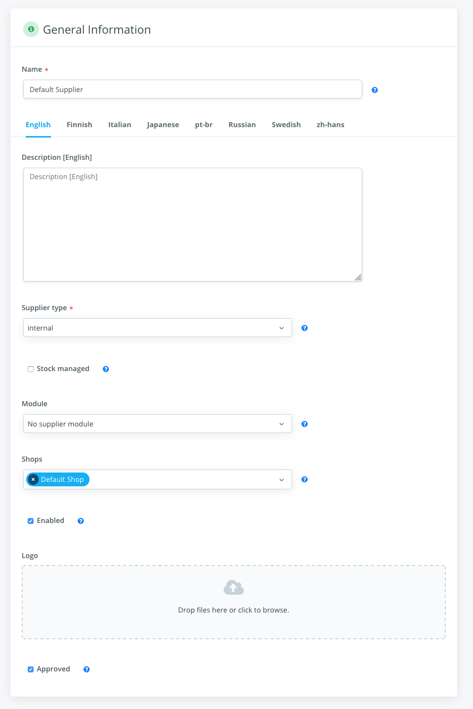
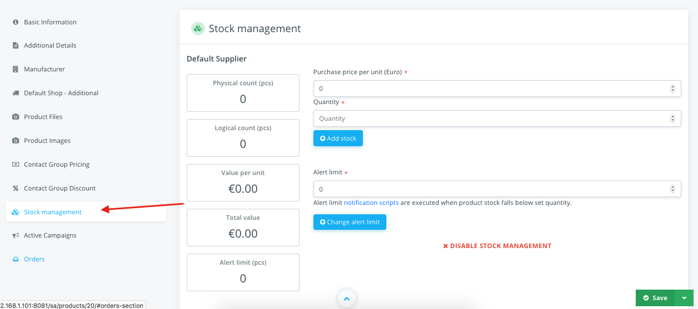
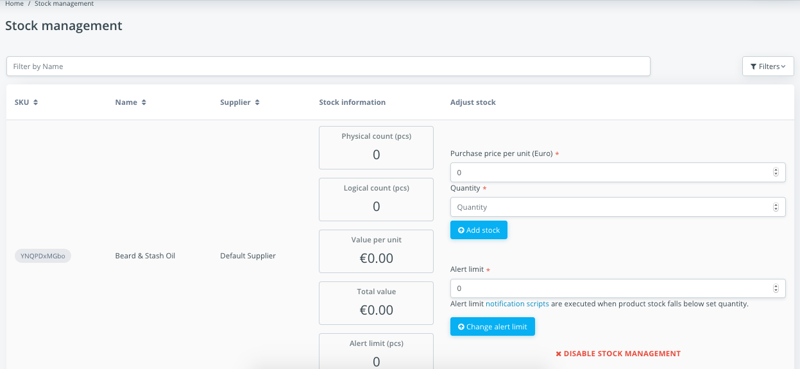

Stock Management
================

Stock management is a crucial feature that all e-commerce platforms must have. 
Shuup is designed to be the more extendable as possible.

To a product be able to be purchased, it `must` have at least a `Supplier` set. 
Suppliers are responsible to return whether a product can be purchased for a 
given quantity (and other context values such as the current customer).

Managing Suppliers
~~~~~~~~~~~~~~~~~~

To manage suppliers, go to `Shops > Suppliers`. Click to create a new supplier 
or edit the current one if your installation only allows a single supplier to 
be used.

Suppliers have a `module` attribute that allows custom implementation of stock 
handling, like fetching the stock status from an ERP and updating the stocks 
through an API call.

Shuup has a simple supplier implementation built-in, it keeps the total number 
of items locally and manages all the events to add/subtract the totals – it is 
enough for the majority cases.

Besides that, the supplier has flags like `Enabled` and `Approved`, they just 
make the supplier available or not in the platform.

The supplier also has a Stock Managed flag, which dictates whether this supplier 
actually manages stocks. If that is disabled, products can be unlimited 
purchased – no stocks check. If the flag is enabled, it is also possible to 
disable stocks check for specific products. The flag is enabled by default.

Once the supplier is created, it can be attached to products. When the simple 
supplier module is being used, it provides a nice management view in product 
admin:

On this management panel it is possible to update stocks, alert limit and 
disable the management for this specific product.

To update stocks, simple fill the `Quantity` field and press the `Add stock`. 
The purchase price can be optionally filled for future reports. Stock will be 
incremented if the quantity is a positive number and decremented if the 
quantity is a negative number.

The alert limit can also be set and when Notifications addon is enabled, it 
will trigger an event that can be configured send email to users or any other 
logic.

It is also possible to manage several products at once in 
`Shops > Stock management`.

