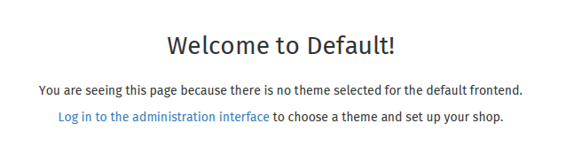
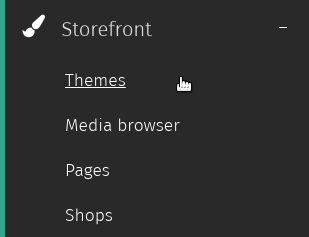
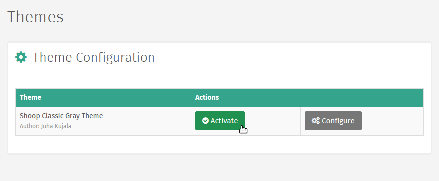

Using Themes
===================

Installing Themes
~~~~~~~~~~~~~~~~~

Shuup Themes (or Xthemes) are downloaded and installed like other
addons.

.. See :ref:`Addons` for general addon installation instructions.

Activating Themes
~~~~~~~~~~~~~~~~~

When a shop is first set up, visitors will see the following notice
until a theme for the shop has been activated.

To activate a theme, go to the Shuup Admin and click `Themes` under the
`Content` category from the Shuup Admin menu.

From here, themes can be activated or configured.

Clicking `Activate` will activate the theme, and by clicking
`Configure`, you can configure any custom theme settings.

Editing a Page
~~~~~~~~~~~~~~

To edit a page:

1. Log in as an administrative user.
2. Navigate to the page on the shop front you want to edit.
3. Click the `Edit Page` button in the upper right-hand corner to enter
   edit mode.

..   .. image:: using-themes/edit-page-button.png

4. Once in edit mode, placeholders will appear as blocks surrounded by
   dotted outlines.

   .. image:: using-themes/edit-mode.png

5. When finished editing, click the `Exit Edit` button to return to
   the normal mode.

..   .. image:: using-themes/exit-edit-button.png

Placeholders
~~~~~~~~~~~~

Placeholders define the regions that a plugin may be included on a
page. The theme source code defines where in the shop's pages
placeholders will appear.

To edit placeholders, enter edit more and click the placeholder you
wish to edit.

See `Editing a Page`_ for more information.

.. note::

   Changes to regular placeholders only affect a single page or view.

   However, if a placeholder is a *global* placeholder, any changes
   will be reflected site-wide. Typically, these are used in areas
   such as headers or footers.

   Refer to your theme documentation regarding which placeholders are
   global placeholders.

Plugins
~~~~~~~

Shuup Xtheme plugins provide an easy way for merchants to customize
their shop frontend.

Shuup comes with a selection of default plugins, or plugins may be
provided by themes or addons.

Adding Plugins
--------------

To add a plugin:

1. Enter edit mode and click the placeholder to which you want to add
   plugins.

2. Click `Add new row` button to add a new row of cells, or to add a
   column to an existing row click the new cell button add a column
   cell.

   .. image:: using-themes/add-new-row-button.png

3. Blank plugin cells will be labelled as *None* and existing cells
   will be labelled with their plugin type. Select the *None* cell to
   configure the plugin settings.

   .. image:: using-themes/blank-plugin.png

5. Select a plugin from the `Plugin` dropdown and enter any required
   plugin settings.

   .. image:: using-themes/plugin-dropdown.png

6. Click the `Save Plugin` button at the bottom of the Xtheme edit
   window to save the plugin settings.

   .. image:: using-themes/save-plugin-button.png

   .. note::

      While in edit mode, placeholder changes will be visible. However,
      they will not be visible outside edit mode until they have been
      published.

7. Click the `Publish Changes` button at the top of the Xtheme edit
   window to save the placeholder settings.

   .. image:: using-themes/publish-changes-button.png
